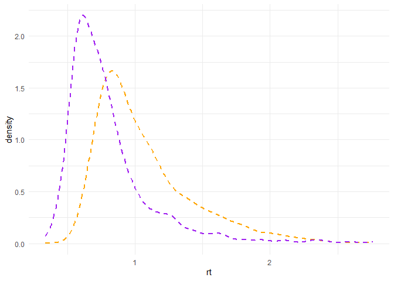
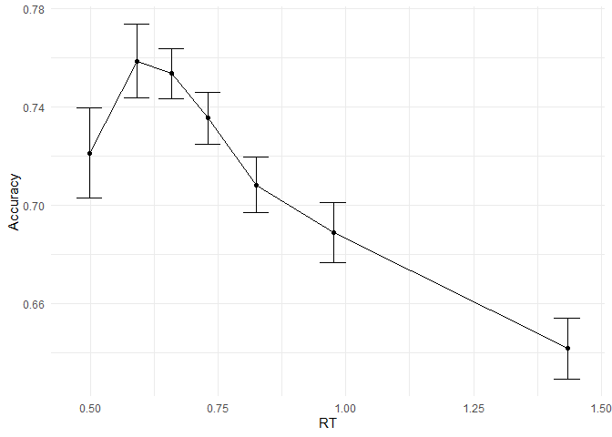

# Autoregressive RDM
Sven Wientjes

In this document, we will discuss, fit, and evaluate the Racing
Diffusion Model (RDM) using Stan. Of special interest is whether we can
make the parameters of the RDM fluctuate according to an AR(1) process.
For a tutorial on how to do this with the DDM, check [this
document](https://github.com/SvenWientjes/AR1_DDM) instead.

## The Racing Diffusion Model (RDM)

The RDM is a generative model of responses and response times.
Typically, it has one racing accumulator for each possible response
option. These accumulators evolve according to an inverse Gaussian or
Wald distribution: For an observed response time $t$, defining
$y = t - T_{er}$ (with $T_{er}$ being a “non-decision time”) and
assuming a fixed diffusion noise $s = 1$ (an assumption we will later
relax) this gives probability density function
$p(y|v,b) = \frac{b}{\sqrt{2 \pi y^3}}e{-\frac{(b-vy)^2}{2y}}$ and
cumulative density
$P(y|v,b) = \Phi(\frac{vy-b}{\sqrt{y}})+e^{2bv} \cdot \Phi(\frac{-vy-b}{\sqrt(y)})$.
Here, $v$ is a drift rate and $b$ is a boundary.

We can use these density functions to represent the decision process as
a competition between multiple responses. Biases in favor of a
particular response can be incorporated as a parameter $db$. Each
accumulator can have its own diffusion noise $s$, but at least one must
be fixed to 1 to satisfy scaling constraints. When this noise differs
across accumulators, drift rates and boundaries can be rescaled by
dividing by the respective diffusion noise, allowing likelihoods to be
computed as usual. The likelihood of observing response $i$ at time $t$
is then given by the density of accumulator $i$ reaching threshold at
time $t$ multiplied by the cumulative probability that all other
accumulators have not reached threshold before $t$:

$f_i(y|\mathbf{v}, b, \mathbf{db}, \mathbf{s}) = p(y|\frac{v_i}{s_i}, \frac{b-db_i}{s_i}) \prod_{j \neq i}[1 - P(y|\frac{v_j}{s_j}, \frac{b-db_j}{s_j})]$

### A 2-AFC parameterization

In a 2-alternative forced choice task, we can set up a particularly
effective parameterization in terms of the differences between the two
relevant accumulators. The diffusion process is going to be biased based
on response identity, but the drifting process itself (both its mean $v$
and its variance $s$) are going to be determined by the stimulus
determining which of the two racers corresponds to the correct response.

In total, our 2AFC RDM will have 6 free parameters,
$[B, db, V, vd, sd, T_{er}]$. $B$ corresponds to the overall response
threshold, $db$ corresponds to the bias in favor of a particular racer
(negative values will favor response 1, positive values will favor
response 2). $V$ is the average drift rate between the two racers. $vd$
and $sd$ are the difference in drift rate and drift rate variability
respectively, between the racer corresponding to the currently correct
response and the racer corresponding to the currently incorrect
response. $T_{er}$ is a non-decision time.

Note that the parameters of this model do not vary across trials, yet we
have six free parameters. This is two more than the DDM without
between-trial variability. This is because the RDM incorporates two
mechanisms in the generative process that the DDM does not. The DDM does
not contain an “average drift rate” analogous to $V$–instead there is
only a single drifting state that evolves according to the relative
evidence in favor of a particular option, mostly mimicking $vd$. Also,
by nature of there being only a single drifting state, there can be no
difference in variability analogous to $sd$.

## Exploring data

Lets begin by loading some packages and useful functions:

``` r
library(cmdstanr)
library(data.table)
library(ggplot2)
source("functions/CAF.R")
source("functions/correlated_errors.R")
source("functions/rWald.R")
```

Before we fit the RDM and discuss its autoregressive extension, lets
explore some empirical data we would like to explain. We will use
Experiment 2B from [Desender et
al. (2022)](https://doi.org/10.1038/s41467-022-31727-0). Let’s load it
and do some simple data wrangling:

``` r
# Load data
MyData <- fread("https://raw.githubusercontent.com/kdesende/dynamic_influences_on_static_measures/refs/heads/main/data_exp2B.csv")

# Get nicer participant numbers
MyData$pp         <- ordered(MyData$sub)
levels(MyData$pp) <- c(1:99)

# Recode stimulus 0 to -1
MyData[stim==0,stim:=-1]

# Mark trials for exclusion
MyData$yi <- 1
MyData[rt<0.1|rt>3.0,yi:=0]
```

Note that we use `$yi` to mark fast and slow outliers with a 0, while
all other trials are marked with a 1. This is how we deal with data
exclusion, while maintaining the original temporal structure of the
data.

### Visualizing RT distributions

We can visualize two marginal RT distributions for illustration
purposes:

``` r
ggplot() +
  geom_density(data = MyData[pp==69 & yi==1], linetype="dashed",linewidth=1, aes(x=rt), color="orange") +
  geom_density(data = MyData[pp==15 & yi==1], linetype="dashed",linewidth=1, aes(x=rt), color="purple") +
  theme_minimal()
```



### Visualizing the conditional accuracy function (CAF)

The Conditional Accuracy Function (CAF) partitions this response time
distribution into different regions with equal numbers of trials in
them. It then visualizes the proportion of correct trials in each bin
against the mean RT of the trials in that bin. This reveals
substantially more errors for very fast responses, as well as
substantially more errors for very slow responses.

``` r
# Get CAF and confidence interval
CAF <- calculate_group_caf(MyData[yi==1], "rt", "cor", "pp", num_bins=7)
CAF[,min_acc:=mean_acc-1.96*se_acc]
CAF[,max_acc:=mean_acc+1.96*se_acc]

## Group conditional accuracy function
ggplot(CAF, aes(x=mean_rt, y=mean_acc)) +
  geom_point() +
  geom_errorbar(aes(ymin=min_acc,ymax=max_acc),width=0.05) +
  geom_line() +
  theme_minimal() +
  xlab("RT") + ylab("Accuracy")
```



## Fitting and exploring the RDM

We can fit the RDM by running the code below. Note that this may take
some time and compute. If you do not find it necessary to spend these
resources, download my fits here and unpack the `.csv` files into
`fits/RDM`.

``` r
# Load model
RDMmod <- cmdstan_model("models/RDM.stan")

# Run over participants to fit
for(PNUM in 1:99){
  Pdat <- MyData[pp==PNUM]
  
  DataList <- list(N       = nrow(Pdat),
                   choice  = Pdat$response,
                   stim    = Pdat$stim,
                   y       = Pdat$rt,
                   yi      = Pdat$yi,
                   min_rt  = min(Pdat[yi==1]$rt))
  
  # Fit the model
  fit <- RDMmod$sample( #65s, 0d
    data            = DataList,
    chains          = 4,
    parallel_chains = 4,
    adapt_delta     = 0.80,
    max_treedepth   = 10,
    init_buffer     = 200,
    term_buffer     = 200,
    window          = 25,
    iter_warmup     = 1975,
    iter_sampling   = 2000,
    output_dir      = "fits/RDM",
    output_basename = paste0("RDM_pp",formatC(PNUM,width=2,flag="0"))
  )
}
```

### Simulating from the RDM

Stan gives us the parameters of the RDM, but we are interested in how
well the RDM accounts for our data. Therefore, we need to simulate from
the model, using the parameters we got from Stan. The code below runs
these simulations. Again, you could instead download my simulations here
and unpack them as `simulations/RDM_simulations.csv`.

``` r
"put simulation code"
```

### Posterior predictive check of RT distributions

We can now check how well our simulations match the empirical RT
distributions of the two participants we visualized above:

``` r
"put visualization code"
```

    [1] "put visualization code"

(compare to DDM?)

### Posterior predictive check of the CAF

We can also check what the relationship between response times and
errors is according to this model:

``` r
"put CAF code"
```

    [1] "put CAF code"

(slow errors?) (compare to DDM–fast errors?)

## Fitting and exploring the AR1-RDM model

Bla.
